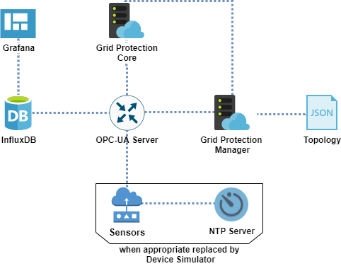
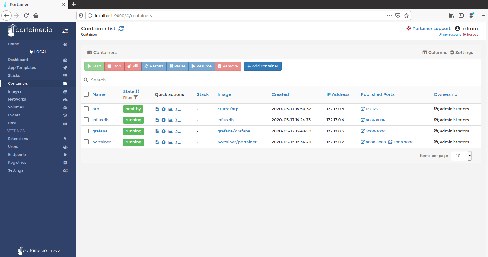
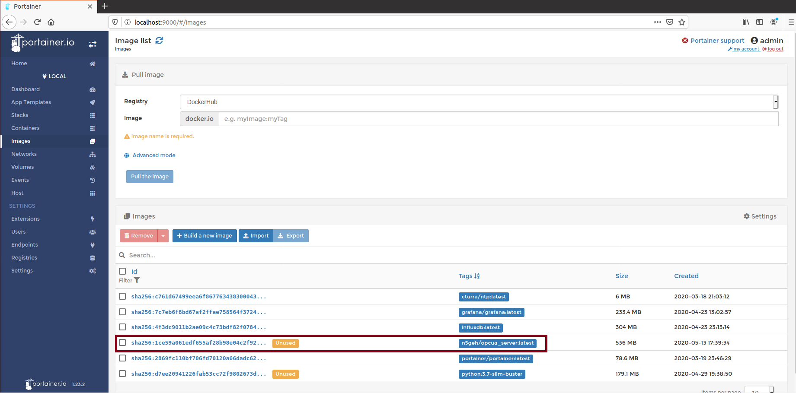
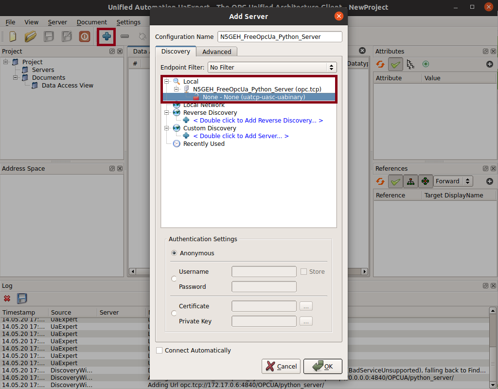
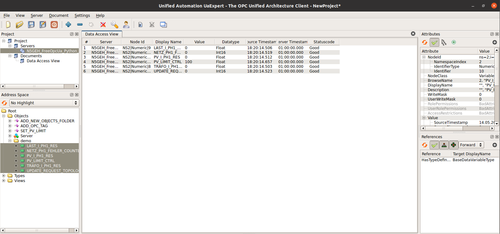
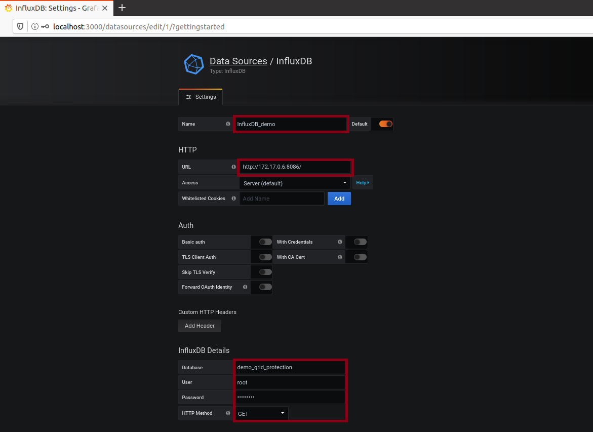
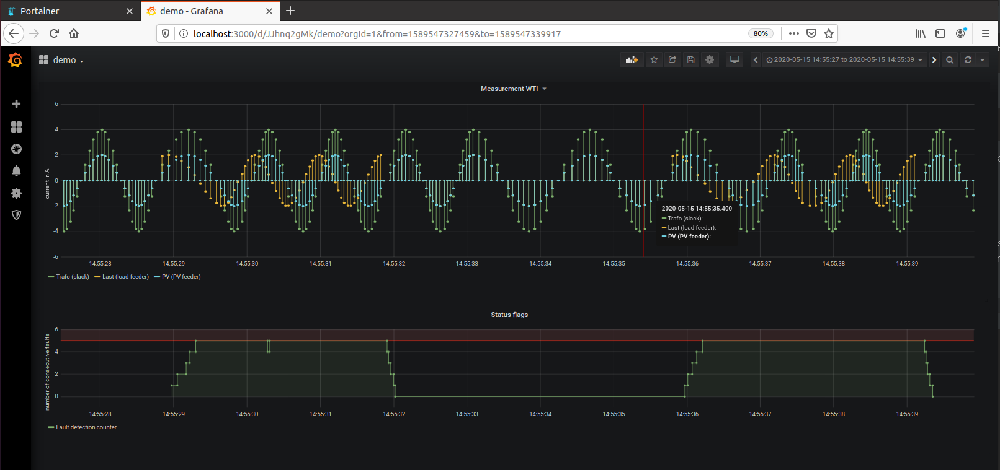
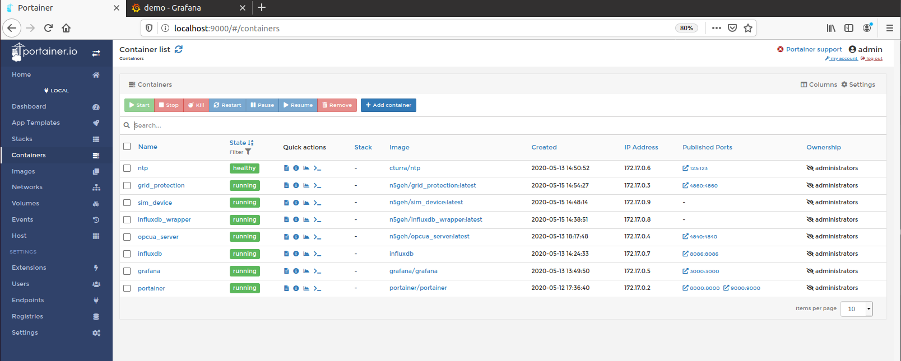

# Tutorial Grid Protection
This is a tutorial of how to run the services for N5GEH use case Grid Protection. For a better understanding of the 
use case and the derived services one should take a look at [wiki.n5geh.de [1]][n5geh_wiki]. The OPC-UA protocol will be used for the communication between field devices and the cloud instance.

To start using the tutorial it is necessary to install Pre-requisites.

## Pre-requisites
- server or virtual machine with linux
- Docker engine (cf. [docs.docker.com [2]][docker_install])
- OPC-UA client ( e.g. [UaExpert [3]][uaexpert_install]) for individual monitoring of OPC-UA variables

## Manual
### Set of services
To visualize the components and their interaction of the grid protection application, a set of optional services will be
deployed first before the core services will be started. The picture below shows the complete set of services for the tutorial.

### Recommended associated services
For visualization and easy configuration additional services are recommended.

#### 1. Graphical user interface for docker administration
For the local graphical administration of docker related services [portainer [4]][portainer] can be used.

Pull the container image via

    $ docker pull portainer/portainer

and deploy via

    $ docker volume create portainer_data
    $ docker run -d -p 9000:9000 -p 8000:8000 --name portainer --restart always -v /var/run/docker.sock:/var/run/docker.sock -v portainer_data:/data portainer/portainer

Then browse to your local [portainer instance][portainer_port] and create a user-password combination and select _Local Docker_ to manage your locally deployed docker containers. 
From now you can **use this GUI within the tutorial for creating or pulling container images and manage their deployment.**

For a scaled up deployment docker-compose files in combination with Kubernetes is recommended instead. 

#### 2. Graphical user interface for database visualization
[Grafana [5]][grafana] is an open source analytics & monitoring solution for every database. Within this tutorial it will be used to show
the time series data from the OPC-UA server stored in the influxdb Database.

Pull the container image via

    $ docker pull grafana/grafana

and deploy via

    $ docker run -d -p 3000:3000 --name grafana --restart always grafana/grafana
A new dashboard will be set up [later](#monitoring-via-grafana) in this tutorial.    

#### 3. Time series database for archiving OPC-UA variables
[InfluxDB [6]][influxdb] is a high-speed read and write database. The data is being written in real-time and one can read in real-time.
It will be used to store time series data from the OPC-UA server.

Pull the container image via

    $ docker pull influxdb

and deploy via

    $ docker run -d -p 8086:8086 --name influxdb --restart always -v influxdb:/var/lib/influxdb influxdb
InfluxDB is now ready for use and will be initialized later.

#### 4. Network Time Protocol server
The [NTP server [7]][ntp] will be used for synchronization of the field measurement devices, the so-called Wireless Transducer Interfaces (WTI).
Have a look at hte NTP server configuration if you want to change the time server.

Pull the container image via

    $ docker pull cturra/ntp

and deploy via

    $ docker run -d -p 123:123/udp --name=ntp --restart=always --cap-add=SYS_TIME cturra/ntp
One can test the NTP container with the follow command:
    
    $ ntpdate -q localhost
  
#### List of services
Here is the list of the services:

* [portainer][portainer_port]: username:admin; password: chosen by user
* [grafana][grafana_port]: username:admin; password:admin (user can change the password immediately)
* [influxdb][influxdb_port]: will show `404 page not found` when set up 
* [ntp][ntp_port]

One can observe the status of the set up container using [portainer][portainer_container].

### Core services
There are four services available for set up via `Dockerfile`. After make the repository available on the local host, 
first the OPC-UA server will be set up, then the protection service itself. Supplementary a database access and a device simulator are provided.

We want to mention two ways to get docker images of these services. The first way is to load ready built docker images 
from the registry at [dockerhub [8]][n5geh_docker_registry], the second is to build each service based on the cloned repository using the `Dockerfiles`.
Both can be done using [portainer][portainer_images]. This tutorial focuses on the second way.

#### Clone repository to local host system using Git
    $ sudo apt install git
For the following it is assumed that the repo was cloned to the local directory `/home/n5geh/grid_protection_repo/`.

    $ git clone https://github.com/N5GEH/<name of repository> <path to local directory you want to clone the repo into>

Now one can build images using
 * the [portainer interface][portainer_images] or 
 * console command: `docker build -t n5geh/<chosen image name>:latest -f <path to Dockerfile> <path to repo directory as context>`. 
 
This tutorial focuses on the second way. 

#### OPC-UA server
To build the OPC-UA server image with the tag `n5geh/opcua_server:latest` run in the console

    $ docker build -t n5geh/opcua_server:latest -f /home/n5geh/grid_protection_repo/docker/Server.Dockerfile /home/n5geh/grid_protection_repo/

After a refresh of the image list it should looks like:

To create and run a container based on this image the exposed port (4840) has to map so that other container can reach this container via calling this port:

    $ docker run -d -p 4840:4840 --name=opcua_server --restart=always n5geh/opcua_server:latest

Now one can again observe or change the status of the existing container using [portainer][portainer_container].

#### Grid Protection service
##### Adaption of device and topology list
This tutorial runs out of the box with a list of six variables as a representation of a simple single phase grid:
* 3 measurement variables
    * `TRAFO_I_PH1_RES`: current measurement at slack
    * `LAST_I_PH1_RES`: current measurement at load feeder
    * `PV_I_PH1_RES`: current measurement at PV feeder
* `PV_LIMIT_CTRL`: control value power infeed (0...100%)
* `NETZ_PH1_FEHLER_COUNTER`: fault state counter for phase 1
* `UPDATE_REQUEST_TOPOLOGY`: request for topology update (no effect as of external provision of new topology file is not implemented yet)
    
This service will create variables at the OPC-UA server out of the list specified via the environment variable `DEVICE_PATH` 
in the `Protection.Dockerfile` (e.g. `/docker/cloud_setup/data/device_config/xx.text`).
One can use the given example to create a custom device list. One may adapt the path in the `Protection.Dockerfile`.

Furthermore, the service will later use a selection of the created variables to run the grid protection. This selection 
can be seen as the topology of the grid under observation and is specified via the environment variable `TOPOLOGY_PATH` 
in the `Protection.Dockerfile` e.g. `/docker/cloud_setup/data/topology/xx.json`).
One can use the given example to create a custom device list. One may adapt the path in the `Protection.Dockerfile`.

##### Deployment
_Important:_ In `Protection.Dockerfile` adapt the env `SERVER_ENDPOINT` (`"opc.tcp://x.x.x.x:4840"`) to corresponding host ip addresses (see [portainer container overview][portainer_container]).

To build the Grid Protection image with the tag `n5geh/grid_protection:latest` run in the console

    $ docker build -t n5geh/grid_protection:latest -f /home/n5geh/grid_protection_repo/docker/Protection.Dockerfile /home/n5geh/grid_protection_repo/

To create and run a container based on this image with the optionally exposed port (4860):

    $ docker run -d -p 4860:4860 --name=grid_protection --restart=always n5geh/grid_protection:latest

##### Monitoring via external OPC-UA client
[UaExpert [3]][uaexpert_install] is used to get a better insight into the OPC-UA structure. This program can be used to monitor 
live data and even call manually server methods.  

Add the OPC-UA server and connect.

#### Device Simulator service
To proof the functionality without real WTIs, measurements can be simply simulated by this service. A loop of sinus waves 
will be calculated and after the half of time one simulated measurement is assigned with an offset to trigger fault detection.
For detail information go for the related `README`.

_Important:_ In `SimDevice.Dockerfile` adapt the env `SERVER_ENDPOINT` (`"opc.tcp://x.x.x.x:4840"`) to corresponding host ip addresses (see [portainer container overview][portainer_container]).

To build the Device Simulator image with the tag `n5geh/sim_device:latest` run in the console

    $ docker build -t n5geh/sim_device:latest -f /home/n5geh/grid_protection_repo/docker/SimDevice.Dockerfile /home/n5geh/grid_protection_repo/

To create and run a container based on this image:

    $ docker run -d --name=sim_device  n5geh/sim_device:latest

Check via UaExpert, that all measurement variables start to change their values.

#### Database access for archiving and superior monitoring
#### Deployment
If one want to archive the values arriving on the OPC-UA server or have a superior insight of data history, this service
provide access to the influxDB set up beforehand.

_Important:_ In `SimDevice.Dockerfile` adapt the env `SERVER_ENDPOINT` (`"opc.tcp://x.x.x.x:4840"`)
as well as `INFLUXDB_HOST` (`"x.x.x.x"`) to corresponding host ip addresses (see [portainer container overview][portainer_container]).

To build the Device Simulator image with the tag `n5geh/influxdb_wrapper:latest` run in the console

    $ docker build -t n5geh/influxdb_wrapper:latest -f /home/n5geh/grid_protection_repo/docker/DatabaseAccess.Dockerfile /home/n5geh/grid_protection_repo/

To create and run a container based on this image:

    $ docker run -d --name=influxdb_wrapper  n5geh/influxdb_wrapper:latest

##### Monitoring via Grafana
Grafana can be used to visualize influxDB data.

The setup is done by:
* open [Grafana][grafana_port]
* select `InfluxDB` as type for Data Sources
* adapt the settings
    * name: `InfluxDB_demo`
    * URL: `http://<INFLUXDB_HOST>:<INFLUXDB_PORT>/`
    * Database: `<INFLUXDB_NAME>`
    * User: `root`
    * Password: `n5geh2019`
    * HTTP Method: `GET`
    
The `INFLUXDB_HOST`, `INFLUXDB_PORT` and `INFLUXDB_NAME` can be customized in the `DatabaseAccess.Dockerfile`. Whereas the password `n5geh2019`
is hardcoded for now in the `InfluxDbWrapper.py`, but can also be specified in the `DatabaseAccess.Dockerfile` by adding a corresponding `env` entry.

Next create a appropriate dashboard by yourself to visualize the history of data. For simplicity one can [import][grafana_import_dashboard] this 
[preconfigured dashboard template][grafana_dashboard_template]. This leads to the following dashboard.

#### Conclusion
If all was set up right, then one have eight container running (cf. following picture).

For a use of real WTIs please stop the container `sim_device` and configure the WTIs instead with the corresponding ip addresses etc.

### Individual testing
##### Using authentication 
It has to mention that to this date (15.05.2020) the used OPC-UA library will **not** work properly using a secured connection over a period longer than one hour (cf. renew opened secure connection).

It is possible to use certificates as well as username/password for the connection between clients and server. To make use 
of this option change `ENABLE_CERTIFICATE` to `"True"` in all `.Dockerfiles`. While within the services this will work out 
of the box, a username/password must be entered for UaExpert when connecting to server. One will find the predefined combinations in [OPCServer.py][OPCServer].

##### Network Time Protocol
To get more in touch with the functionality of the NTP, one can use the simple ntp_client.py provided in the repository directory _/ntp_.

### Links
[[1] https://wiki.n5geh.de/display/EN/Grid+Protection][n5geh_wiki] \
[[2] https://docs.docker.com/engine/install/ubuntu/][docker_install] \
[[3] https://www.unified-automation.com/de/downloads/opc-ua-clients.html][uaexpert_install] \
[[4] https://hub.docker.com/r/portainer/portainer/][portainer] \
[[5] https://hub.docker.com/r/grafana/grafana/][grafana] \
[[6] https://hub.docker.com/_/influxdb][influxdb] \
[[7] https://hub.docker.com/r/cturra/ntp/][ntp] \
[[8] https://hub.docker.com/u/n5geh][n5geh_docker_registry]

[n5geh_wiki]: https://wiki.n5geh.de/display/EN/Grid+Protection
[n5geh_docker_registry]: https://hub.docker.com/u/n5geh

[docker_install]: https://docs.docker.com/engine/install/ubuntu/
[uaexpert_install]: https://www.unified-automation.com/de/downloads/opc-ua-clients.html

[portainer]: https://hub.docker.com/r/portainer/portainer/
[portainer_port]: localhost:9000
[portainer_images]: localhost:9000/#/images
[portainer_container]: http://localhost:9000/#/container

[grafana]: https://hub.docker.com/r/grafana/grafana/
[grafana_port]: localhost:3000
[grafana_import_dashboard]: http://localhost:3000/dashboard/import
[grafana_dashboard_template]: grafana_dashboard_demo.json

[influxdb]: https://hub.docker.com/_/influxdb
[influxdb_port]: localhost:8086

[ntp]: https://hub.docker.com/r/cturra/ntp/
[ntp_port]: localhost:123

[OPCServer]: /docker/cloud_setup/opc_ua/server/OPCServer.py
